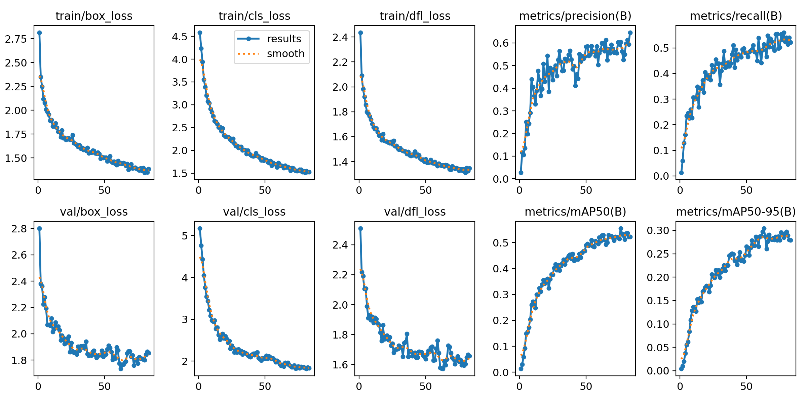
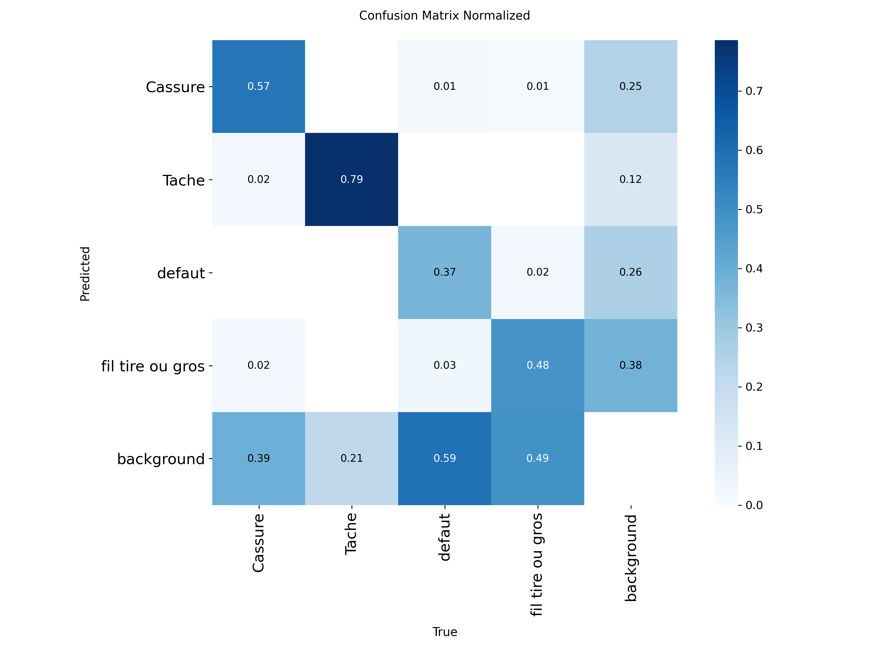
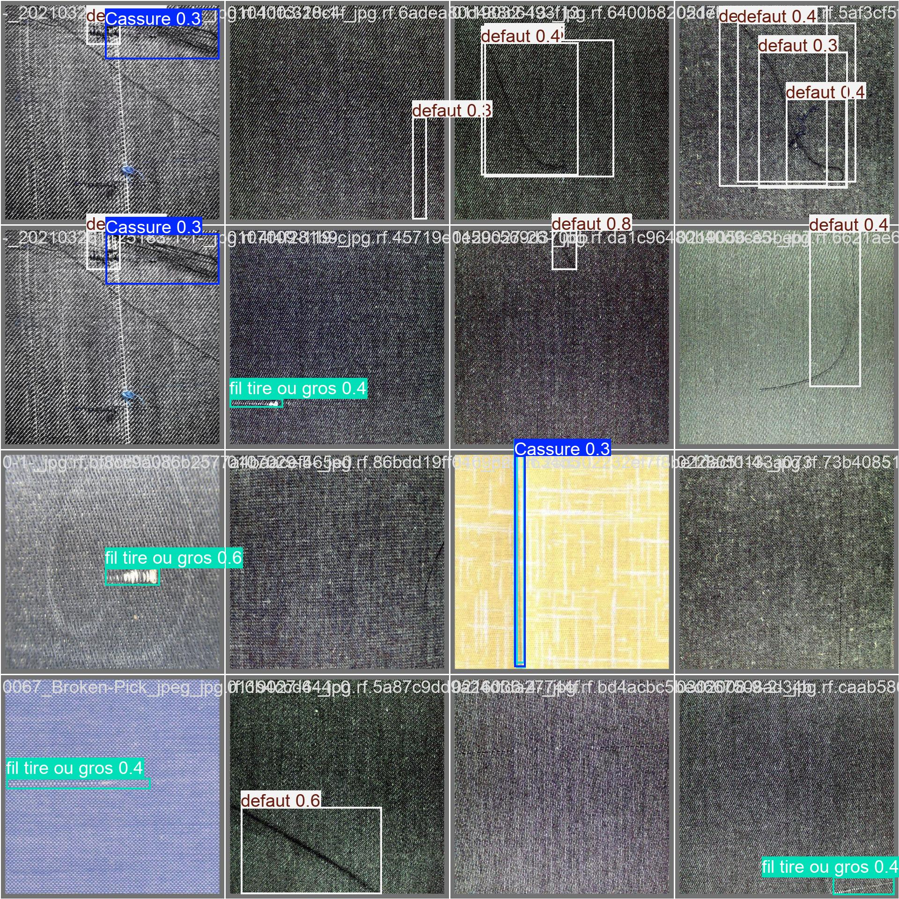
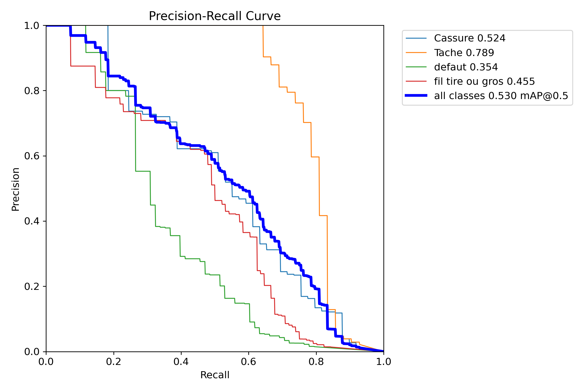
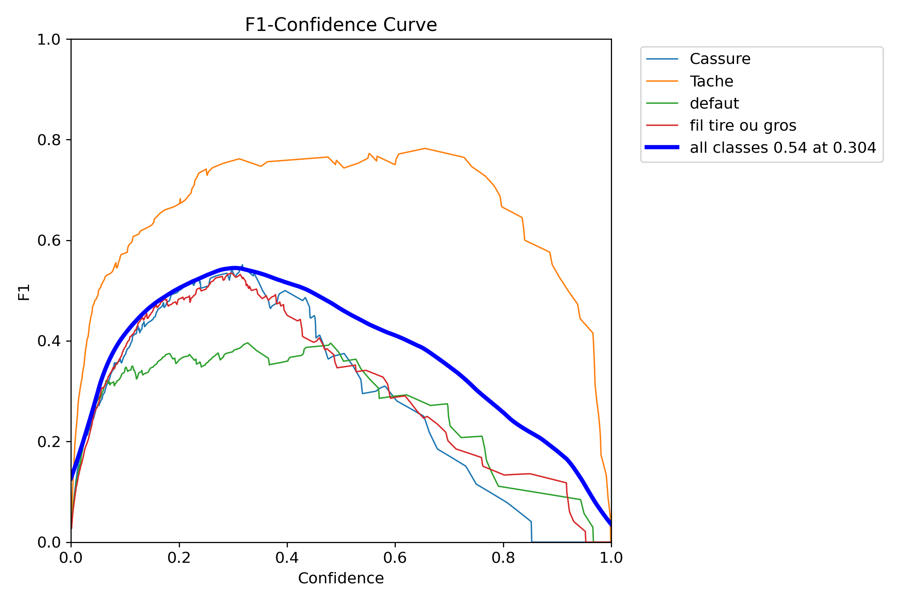

# 纺织织物瑕疵检测系统 · Fabric Defect Detection

基于 YOLOv8 的工业视觉质检项目｜AI 产品落地实践

> 面向纺织车间一线质检场景，针对 4 类高频瑕疵构建轻量化视觉检测模型，探索从「业务痛点挖掘」到「AI 视觉模型落地」的完整产品闭环。

---

## 项目背景

传统纺织车间的成品质检依赖人工目检，存在三个核心痛点：

- **漏检率高**：抽丝、断裂、细小污渍等瑕疵在快速流转的面料上肉眼难以稳定捕捉
- **标准不一致**：不同检验员对"同一瑕疵"的判定存在主观差异
- **效率瓶颈**：熟练质检员培养周期长，人力成本逐年上升

本项目尝试用 YOLOv8 视觉检测模型替代部分人工环节，为后续的 AI 质检助手（RAG 版本）提供视觉输入能力。

---

## 核心指标

| 指标 | 数值 |
|------|------|
| **mAP@0.5** | **55.5%** |
| **mAP@0.5:0.95** | 27.9% |
| 精确率 (Precision) | 64.7% |
| 召回率 (Recall) | 52.2% |
| 最佳单类 AP（Tache 污渍） | **78.9%** |
| 模型大小 | 5.97 MB |
| 训练硬件 | RTX 4070 Laptop GPU |
| 训练时长 | 约 24 分钟（100 epochs） |

---

## 检测类别

| 类别 | 含义 | AP@0.5 |
|------|------|--------|
| Tache | 污渍 | 78.9% |
| Cassure | 断裂 | 52.4% |
| fil tiré ou gros | 抽丝/粗节 | 45.5% |
| défaut | 缺陷 | 35.4% |

---

## 效果展示

### 训练曲线



### 混淆矩阵（归一化）



### 验证集预测样例



### PR 曲线 & F1 曲线

| PR 曲线 | F1 曲线 |
|---------|---------|
|  |  |

---

## 技术栈

- **模型框架**：Ultralytics YOLOv8s（迁移学习，基于 `yolov8s.pt` 预训练权重）
- **深度学习**：PyTorch 2.6.0 + CUDA 12.4
- **推理演示**：Streamlit Web UI / OpenCV 视频流
- **数据集**：1151 张标注样本，4 类瑕疵，70/20/10 划分

---

## 关键决策记录

作为一名产品背景的开发者，本项目的价值不仅在于技术实现，更在于产品决策过程。

### 决策 1：从「调参导向」转向「数据策略导向」

前期训练中发现一个严重问题——**正常纹理图案频繁被误判为瑕疵**（误报率高）。

- 第一直觉是调参：调整置信度阈值、修改损失函数权重
- 最终判断：问题根源是**数据集中缺乏"正常但纹理复杂"的负样本**
- 解决方案：制定**负样本采集标准**，主动注入复杂纹理的正常样本，从产品侧定义数据质量规范

结果：误报率显著下降，模型对正常纹理的鲁棒性提升。

### 决策 2：从 CPU 迁移到 GPU 训练

初期 8 轮 CPU 训练 mAP 徘徊在 19.6%，迭代周期长达 2.5 小时/轮，严重拖慢实验节奏。

- 判断：算力瓶颈是当前最大短板
- 行动：配置 CUDA 12.4 + PyTorch GPU 环境，切换到 RTX 4070 训练
- 结果：**单轮训练从 2.5h 降至 24min，mAP 从 19.6% 提升至 55.5%**

### 决策 3：模型规模的权衡

从 `yolov8n`（最小版）升级到 `yolov8s`（小型版）。

- 权衡：推理速度略降 vs 精度显著提升
- 场景考量：质检场景对实时性要求不如安防严苛，精度优先
- 结果：模型仅 5.97 MB，仍可流畅部署于边缘设备

---

## 快速使用

### 环境配置

```bash
pip install -r requirements.txt
```

### 运行 Web Demo（Streamlit 交互界面）

```bash
streamlit run web_demo.py
```

### 图片批量预测

```bash
python predict_test.py
```
> 将测试图片放入 `test_images/` 目录即可。

### 视频流检测

```bash
python video_demo.py
```

---

## 项目结构

```
fabric-defect-detection-release/
├── train_safe_landing.py      # 训练主脚本
├── web_demo.py                # Streamlit Web 演示
├── video_demo.py              # 视频流检测
├── predict_test.py            # 批量图片预测
├── data.yaml                  # 数据集配置
├── requirements.txt           # 依赖清单
├── test_images/               # 测试图片目录（用户自填）
└── results/
    ├── weights/best.pt        # 最终模型权重（5.97 MB）
    ├── results.csv            # 训练指标逐 epoch 记录
    ├── results.png            # 训练曲线
    ├── confusion_matrix.png
    ├── confusion_matrix_normalized.png
    ├── BoxPR_curve.png
    ├── BoxF1_curve.png
    └── val_batch0_pred.jpg
```

---

## 下一步优化方向

- [ ] **扩充数据集**：当前 1151 张样本，计划扩充至 3000+，重点补齐 `défaut` 和 `fil tiré` 类别
- [ ] **加权损失函数**：针对漏检多的小类别引入 focal loss，改善类别不平衡
- [ ] **部署为 API 服务**：用 FastAPI 封装推理接口，对接上层 RAG 质检助手
- [ ] **接入 RAG 工作流**：视觉检测结果 + 纺织质检知识库 → 自动生成处理建议

---

## License

MIT
